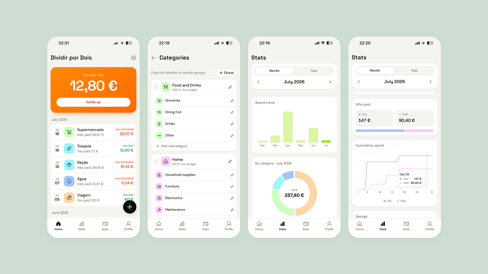

# Dividir por Dois

### A private, two-user expense tracker webapp for splitting shared household costs.
Built for exactly two people. Each household runs its own copy with its own database and hosting, so everything stays private.

<div align="center">



</div>


| Features| |
|---|---|
| **Split expenses** | Log amount, description, category, date, and who paid. Each expense is split 50/50 or fully solo, and Home keeps a running balance of who owes whom since your last settlement. |
| **Settle up** | One tap records a settlement and clears the list. The most recent one can be undone if you tapped it by mistake, and past settlements are kept as history. |
| **Categories** | A nested tree of categories and subcategories, each with customizable icons and colors. Deleting one reassigns its expenses to Uncategorized rather than orphaning them. |
| **Budgets** | Set a monthly budget per category, then track budget vs. actual spend for the month on the Stats screen. |
| **Stats** | Month or year view with a spend-trend bar chart, category pie chart, per-person cumulative line chart, spend by payer, budget vs. actual, and a filterable expense list. Export any period to CSV. |
| **Subscriptions** | A standalone tracker for recurring costs, monthly or yearly, shared or solo. Everything normalizes to a monthly figure so costs are comparable, and subs can be paused without deleting. Kept separate from the balance and charts. |
| **Savings tracker** | Each person logs how much they put aside (or overspent) each month. Home nudges you when a month ends, a year calendar lets you edit past months, and Stats charts both people side by side. |
| **Web or desktop** | Use it straight from the browser, or install it as an app. It ships as a PWA, so you can add it to your home screen on mobile or install it as a desktop app for its own window. |


## Tech Stack

| Layer |  |
|---|---|
| **Frontend** | React (Vite) + Tailwind CSS v4 + shadcn/ui |
| **Database** | Firebase Firestore |
| **Auth** | Firebase Auth (email/password), two accounts you create by hand, no signup flow |
| **Hosting** | Any static host; these instructions use Netlify as an example |

## Setup

### 1. Fork the repo

Fork this repository to your own GitHub account, then clone your fork locally. If you want to pull in later updates, you can sync your fork manually from GitHub's **Sync fork** button whenever you like.

### 2. Create your Firebase project

1. Go to the [Firebase console](https://console.firebase.google.com/) and create a new project.
2. Enable **Firestore Database** (production mode is fine, the security rules below lock it down).
3. Enable **Authentication > Sign-in method > Email/Password**.
4. Under **Authentication > Users**, manually add exactly two users (one per person), each with an email and password. There is no in-app signup flow, this is the only way accounts get created.
5. Copy each user's **UID** shown in the Authentication table, you'll need both in the next steps.
6. Under **Project settings > General > Your apps**, add a Web app and copy the `firebaseConfig` values.

### 3. Configure the app

```bash
npm install
cp .env.example .env.local
```

Fill in `.env.local` with the `firebaseConfig` values from step 2.6. These values are not secrets, they ship in the compiled frontend bundle. Access is secured by the Firestore rules below, not by hiding these.

### 4. Lock down Firestore

Open `firestore.rules` and replace the two placeholder UIDs with the two real UIDs from step 2.5:

```
allow read, write: if request.auth != null
  && request.auth.uid in ['<PERSON_1_UID>', '<PERSON_2_UID>'];
```

Paste the updated rules into **Firestore Database > Rules** in the Firebase console and publish. (If you use the Firebase CLI instead, `firebase deploy --only firestore:rules` works too.)

### 5. Seed the database

```bash
npm run dev
```

Sign in with one of the two accounts you created, then visit `/seed` (this route only exists in dev mode, it's excluded from production builds). Fill in each person's display name and UID, and click **Seed database**. This writes the two `users` docs and the default category tree once. You can re-run it later with force reseed, but that duplicates categories, only use it on an empty database.

### 6. Deploy to Netlify (or any other hosting service)

1. In Netlify choose **Add new site > Import an existing project** and connect your fork.
2. Build settings:
   - Build command: `npm run build`
   - Publish directory: `dist`
3. Add the same variables from your `.env.local` under **Site configuration > Environment variables** (all six `VITE_FIREBASE_*` keys).
4. Deploy. The included `public/_redirects` file handles client-side routing so refreshing or linking directly to `/stats`, `/profile`, etc. works correctly on Netlify.

Any other static host that supports SPA fallback routing and Vite builds works the same way, Netlify is just the example used here.

## Development

```bash
npm run dev      # local dev server
npm run build    # typecheck + production build
npm run lint     # oxlint
```

## License

MIT, see [LICENSE](LICENSE).
